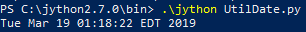

# What is Jython?

Jython is the JVM implementation of the Python programming language. It is designed to run on the Java platform. A Jython program can import and use any Java class. Just as Java, Jython program compiles to bytecode.

## Why am I trying this crazy combination of Python and Java?

Why not? My very first computer language that I learned was Java and I've survived several university classes with Java. From principle of computer science to data structure to algorithm to operating system class, Java was my friend and I will always go back to Java whenever I can. Python is the language that I mostly used to work on any type of data programming class. So let see what happen when I used both languages together.

## Projects

I truly don't know what the file structure will look like but I will update this README as I include in different projects and codes.

## UtilDate.py

This is me running the UtilDate python file that imported in the java.util package. Then for the variable and codes below, I used Python syntax to print out the current date.

## tryThis.py

With this code, I'm trying to import in a java package (foo), that contain the .class file or .java file into the tryThis.py file. I'm not having any success at this time (3/19/2019) but I will continue to find a way to import in classes from package since I think this functionality will be useful to reuse different self-created class to be imported into different python file.
